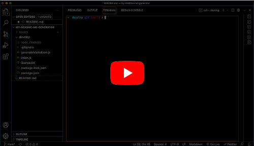
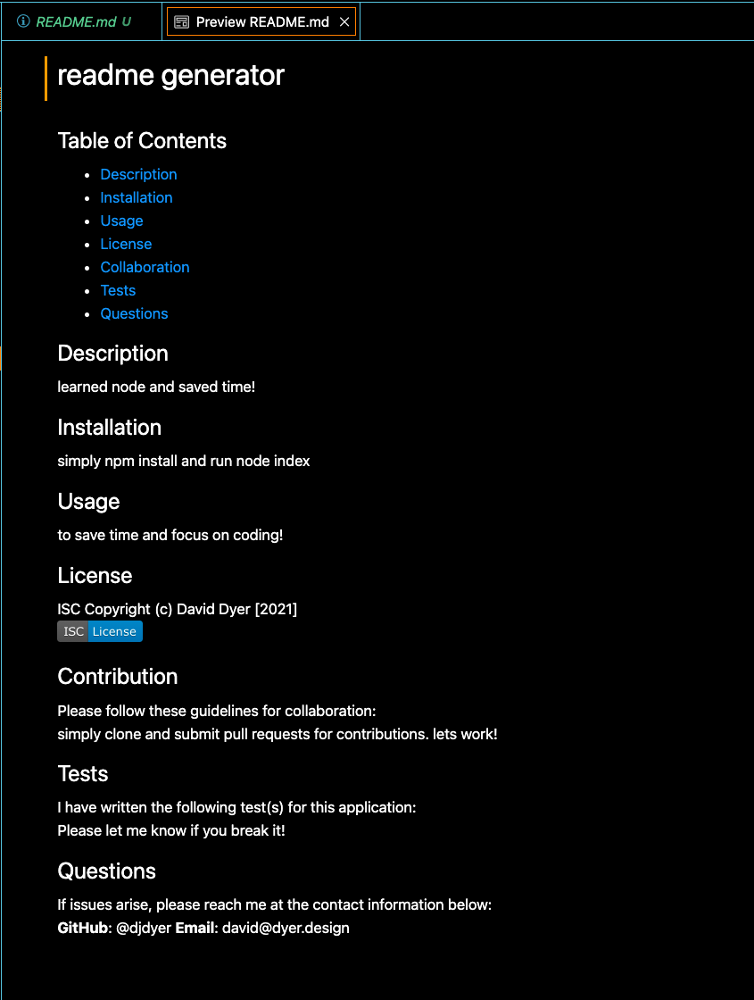

# my-readme-md-generator

<br />

## Table of Contents

- [Description](#description)
- [Installation](#installation)
- [Usage](#usage)
- [License](#license)
- [Screenshots/Demo](#screenshots-demo)
- [Criteria](#acceptance-criteria)
- [Collaboration](#collaboration)

<br />

## Description

1. **Purpose**: To create a comprehensive markdown file, per user inputs.
2. **Motivation**: Leaves more time to focus on writing code.
3. **Problem solved**: Saves time and eliminates guesswork in markdown composition.
4. **What I learned**: How to create and run Node applications.

<br />

## Installation

App is invoked by first running 'npm install', then typing 'node index' in the command line.

<br />

## Usage

```
As a developer
I WANT a README generator
SO THAT I can quickly create a professional README for a new project.
```

<br />

## License

ISC License  
Copyright (c) David Dyer [2021]  
[](./develop/license.txt)

<br />

## Screenshots Demo

[](https://youtu.be/S7P_PQ7qJh0)

<br />



<br />
<br />
<br />

## Acceptance Criteria

```
Command line application accepts user input.

User prompted for information about application repository:
- title
- description
- installation instructions
- usage information
- license
- contributing
- tests
- questions

Inputs added to corresponding section titles for README.md.

When choosing license from list of options, badge is added to README.md,
notice added to license section linked to coverage.

Entering GitHub user name adds profile link to questions section,
with instructions for how to contact.

Entering email address adds to questions section, with additional
contact instructions.

When clicking links in table of contents, user is directed to corresponding section.

```

## Collaboration

Development efforts most often include guidance from  
Jedi Master: **Chris Champness**

[](https://github.com/CChampness)

**Reporting issues**:  
Contact @djdyer to report bugs.

**Contributions**:  
Clone branch, submit pull request for review after completing any improvements.

<br />

Thanks for taking a look!  
👋
